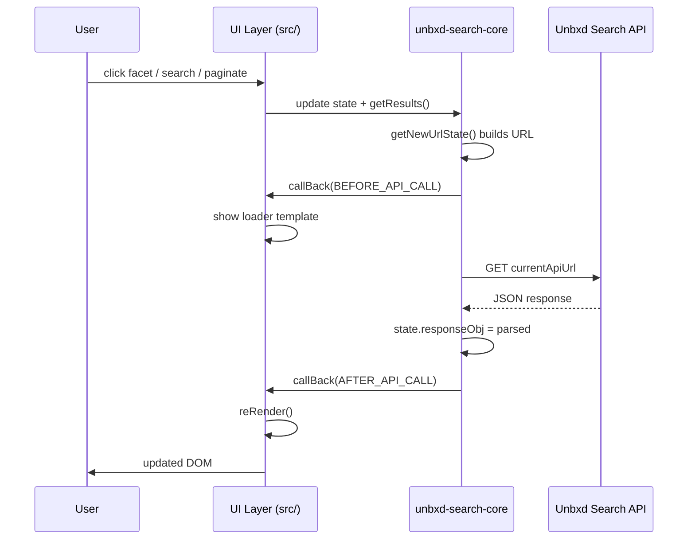

# Search SDK — Internal Architecture & Debugging Guide

> **Package**: `@unbxd-ui/vanilla-search-library` v2.1.14  
> **Core dependency**: `@unbxd-ui/unbxd-search-core` v0.5.13  
> **Built artifact**: `public/dist/js/vanillaSearch.js` (UMD global `UnbxdSearch`)  
> **CDN**: `https://libraries.unbxdapi.com/search-sdk/v2.1.14/vanillaSearch.min.js`  
> **Public docs**: https://unbxd.github.io/search-JS-library/

This document is for internal engineers debugging customer integrations, tracing SDK behavior, and extending the vanilla search library. For customer-facing configuration reference, see the Jekyll docs in `docs/` or `unbxd-search-sdk-docs.md` in customer-js.

---

## Table of Contents

1. [Repository Structure](#1-repository-structure)
2. [Two-Layer Architecture](#2-two-layer-architecture)
3. [Core Modules](#3-core-modules)
4. [Data Flow](#4-data-flow)
5. [Event System](#5-event-system)
6. [State Management](#6-state-management)
7. [API Layer](#7-api-layer)
8. [Rendering](#8-rendering)
9. [Configuration](#9-configuration)
10. [Extension Points](#10-extension-points)
11. [Debugging Guide](#11-debugging-guide)
12. [Module Dependency Graph](#12-module-dependency-graph)

---

## 1. Repository Structure

### Top-level layout

| Path | Purpose |
|------|---------|
| `src/` | **UI layer** — extends core, renders DOM, binds events |
| `src/index.js` | Main entry — `class UnbxdSearch extends UnbxdSearchCore` |
| `src/core/` | Init, config merge, layout, re-render, validation, event binding |
| `src/modules/` | Feature modules (facets, pagination, sort, products, analytics, etc.) |
| `src/common/` | Default `options.js`, constants (`eventsLib`, `actions`, CSS classes) |
| `styles/` | Default SCSS theme (`index.scss`) bundled into CSS |
| `webpack/` | Webpack configs (dev server, prod UMD build) |
| `public/dist/` | Production build output (`vanillaSearch.js`, `.css`, source maps) |
| `public/examples/` | Integration examples (infinite scroll, SEO URLs, facets, etc.) |
| `demo/` | Local dev demo (`demo/js/index.js` + `demo/index.html`) |
| `docs/` | Jekyll documentation site (config reference, events, methods) |
| `polyfill/` | IE polyfill entry (`iePolyfill.js`) |

### Build system

- **Bundler**: Webpack 5 + Babel (`@babel/preset-env`)
- **Dev**: `npm start` → `webpack-dev-server` with entries `app` (demo) + `unbxdSearch` (`src/index.js`)
- **Prod**: `npm run build` → `webpack/webpack.prod.config.js`
  - Entry: `src/index.js` → UMD library `UnbxdSearch`
  - Output: `public/dist/js/vanillaSearch.js`, `public/dist/css/vanillaSearch.css`
  - Gzip variants: `vanillaSearch.min.js` / `.min.css`
- **Release**: GitHub Actions tag builds → S3 upload + npm publish (`@unbxd-ui/vanilla-search-library`)

### Entry point

```
src/index.js
  ├── import UnbxdSearchCore from "@unbxd-ui/unbxd-search-core"
  ├── import styles from "../styles/index.scss"
  ├── setConfig(options, props)          // deep-merge config
  ├── setMethods(UnbxdSearch)            // attach all UI prototype methods
  └── export default UnbxdSearch
```

The npm `main` field points to `public/dist/js/vanillaSearch.js`.

---

## 2. Two-Layer Architecture

```
┌─────────────────────────────────────────────────────────┐
│  @unbxd-ui/unbxd-search-core (UnbxdSearchCore)          │
│  API calls, state, URL sync, facet logic, routing       │
└───────────────────────┬─────────────────────────────────┘
                        │ extends
┌───────────────────────▼─────────────────────────────────┐
│  search-JS-library (UnbxdSearch)                        │
│  DOM layout, templates, event delegation, reRender()      │
└─────────────────────────────────────────────────────────┘
```

**Rule of thumb**: If it touches the network, URL, or facet/sort/pagination state, it lives in **core**. If it touches the DOM, templates, or user interaction wiring, it lives in **this repo**.

Core source is published as `@unbxd-ui/unbxd-search-core`. When debugging a CDN build without `node_modules`, use `public/dist/js/vanillaSearch.source.js` — it inlines the bundled core.

---

## 3. Core Modules

### 3.1 UI layer — main class

**File**: `src/index.js`  
**Class**: `UnbxdSearch extends UnbxdSearchCore`

Constructor responsibilities:

- Initializes `this.viewState` (UI-only ephemeral state)
- Calls `setConfig(options, props)` — deep merge defaults + customer config
- Fires `onEvent(this, 'before_initialised')` and `'initialised'`
- Calls `updateConfig()` → re-merges config + `initialize()`
- Exposes `this.events`, `this.actions`, `this.cssList`, `this.testIds`
- Overrides `callBack(state, type)` — bridges core lifecycle to UI (loader, reRender, analytics)

### 3.2 UI layer — core orchestration

| File | Key functions | Responsibility |
|------|---------------|----------------|
| `src/core/setMethods.js` | `setMethods`, `updateConfig`, `getCategoryPage`, `getBrowsePage`, `extraActions` | Attaches all module methods to prototype; runtime config updates |
| `src/core/initialize.js` | `initialize` | Validates config, creates DOM layout, binds events, hydrates from URL |
| `src/core/setConfig.js` | `setConfig` | Deep-merge via `extend()`; special handling for facet/productView/swatches |
| `src/core/createLayout.js` | `createLayout` | Mounts wrapper elements into customer DOM containers |
| `src/core/bindEvents.js` | `bindEvents` | Event delegation for search, facets, pagination, sort, spellcheck, popstate |
| `src/core/reRender.js` | `reRender` | Master render pipeline after API response |
| `src/core/validateConfigs.js` | `validateConfigs` | Schema validation via `configSchema.js` |
| `src/core/configSchema.js` | `paginationSchema`, `facetsSchema`, etc. | Per-module config datatype/required/allowedOptions rules |
| `src/core/componentWrappers/` | `createSearchWrapper`, `createFacetWrapper`, etc. | Factory functions that create inner wrapper DOM nodes |

### 3.3 UI layer — feature modules

| Module path | Methods attached | Responsibility |
|-------------|------------------|----------------|
| `modules/searchResults/` | `renderSearch`, `renderProducts`, `handleNoResults`, `onProductItemClick`, `mapProductAttrs` | Product card HTML generation, no-results, click handling |
| `modules/facets/` | `renderFacets`, `renderTextFacet`, `renderRangeFacet`, `renderMultiLevelFacet`, `renderSelectedFacets`, `findChangedFacet`, `setRangeSlider`, `checkFacets` | Facet UI rendering + click routing to core facet actions |
| `modules/pagination/` | `renderPagination`, `paginationAction`, `renderNewResults`, `setUpInfiniteScroll`, `getProductsPerPage`, `getCurrentUrlPage` | Fixed, infinite scroll, click-n-scroll pagination |
| `modules/sort/` | `sortAction`, `renderSort` | Sort UI + delegates to core `applySort()` |
| `modules/pageSize/` | `renderPageSize`, `onClickPageSize`, `setPageSize` | Page size selector |
| `modules/input/` | `setInputValue` | Search box submit → `resetAll()` → `getResults()` |
| `modules/didYouMean/` | `renderDidYouMean`, `setSuggestion` | Spell-check / did-you-mean UI |
| `modules/breadcrumbs/` | `renderBreadCrumbs` | Category breadcrumb rendering |
| `modules/banners/` | `renderBannerUI` | Promotional banner rendering |
| `modules/swatches/` | `renderSwatchBtns` | Color swatch buttons on product cards |
| `modules/productViewType/` | `renderProductViewTypeUI`, `onPageViewTypeClick` | Grid/list toggle |
| `modules/analytics/` | `getCallbackActions`, `trackSearch`, `trackImpression`, `trackFacetClick`, `trackProductClick` | Wraps `window.Unbxd.track()` when `unbxdAnalytics: true` |

### 3.4 Core package (`@unbxd-ui/unbxd-search-core`) — method groups

Core methods are attached to `UnbxdSearchCore.prototype` via `Object.assign` blocks in the bundled core.

**URL & routing**

- `getBaseUrl()`, `getNewUrlState()`, `getQueryParams()`, `getStateFromUrl()`
- `renderFromUrl()`, `setUrl()`, `readQueryParamsFromUrl()`
- `facetsToWebUrlString()`, `getSortUrlString()`, `getPageSizeStr()`, etc.
- `onLocationChange()`, `setRoutingStrategies` (config callback)

**Pagination**

- `setPageStart()`, `getPaginationInfo()`, `setPageSize()`

**Search & API**

- `getResults()`, `getSearchResults()`, `getSearchQuery()`, `getSearchQueryParams()`
- `getSearchMeta()`, `getResponseObj()`, `setStateFromData()`
- `processVariantMap()`, `getProductByPropValue()`, `getRequestId()`

**Facets** (largest group)

- `getFacets()`, `getAllFacets()`, `getSelectedFacets()`, `updateFacets()`, `applyFacets()`
- `deleteAFacet()`, `setRangeFacet()`, `applyRangeFacet()`, `clearARangeFacet()`
- `setCategoryFilter()`, `deleteCategoryFilter()`, `getFilterFromParams()`
- `modifyFacetsList()`, `encodeFacetValue()`, `decodeFacetValue()`, etc.

**Other core groups**

- Breadcrumbs: `getBreadCrumbsList()`, `getBreadCrumbs()`
- Sort: `applySort()`, `getSelectedSort()`, `setSort()`
- Spell check: `getDidYouMeanFromResponse()`, `getSpellCheckSuggested()`, `setSpellCheck()`
- Banners: `getBanners()`
- State reset: `changeInput()`, `resetFacets()`, `resetAll()`

---

## 4. Data Flow

### Initialization sequence

```
new UnbxdSearch(customerConfig)
  │
  ├─ UnbxdSearchCore constructor (core: init this.state, this.options)
  │
  ├─ UI constructor: init this.viewState
  ├─ setConfig(defaultOptions, customerConfig)     // deep merge
  ├─ onEvent('before_initialised')
  ├─ updateConfig()
  │    ├─ setConfig() again
  │    └─ initialize()
  │         ├─ validateConfigs()                   // schema checks → CONFIG_ERROR
  │         ├─ createLayout()                      // mount DOM wrappers
  │         ├─ bindEvents()                        // delegation + popstate
  │         └─ renderFromUrl() if URL has params   // hydrate state from URL
  ├─ onBackFromRedirect()
  └─ onEvent('initialised')
```

### Search request flow

```
User action (search submit / facet click / pagination / sort)
  │
  ├─ UI handler (e.g. setInputValue, findChangedFacet, paginationAction)
  │    ├─ Updates this.state.* (facets, sort, page) via core methods
  │    └─ Calls getResults(query?, isAppend?, action?)
  │
  ├─ getResults() [CORE]
  │    ├─ Guard: if isLoading → return false
  │    ├─ state.isLoading = true
  │    ├─ getNewUrlState(true) → builds state.currentApiUrl
  │    ├─ URL sync check → may call setUrl(true) and short-circuit
  │    ├─ callBack(this, BEFORE_API_CALL)         // UI: show loader
  │    ├─ fetch(state.currentApiUrl, GET)         // with default headers
  │    ├─ Parse JSON → state.responseObj
  │    ├─ processVariantMap() if variants enabled
  │    ├─ Modify facets list in response
  │    ├─ Merge products (append for infinite scroll prev/next)
  │    ├─ state.isLoading = false
  │    └─ callBack(this, AFTER_API_CALL)          // UI: reRender()
  │
  └─ reRender() [UI]
       ├─ onEvent(BEFORE_RENDER)
       ├─ renderProducts() or handleNoResults()
       ├─ renderFacets(), renderSelectedFacets(), renderBannerUI()
       ├─ renderPageSize(), renderSort(), renderBreadCrumbs()
       ├─ renderDidYouMean(), renderPagination()
       └─ onEvent(AFTER_RENDER)
```

### Sequence diagram



### Browser back/forward

`bindEvents()` registers `window.addEventListener('popstate', onLocationChange)`:

- `onLocationChange()` checks for Unbxd URL keys
- If keys present → `renderFromUrl()` hydrates `state` from URL → `getResults()`
- If no keys → `onNoUnbxdKeyRouting()` (default: `history.go()`)

---

## 5. Event System

### 5.1 `onEvent` callback (primary hook)

**Config**: `options.onEvent(instance, type, payload)`  
**Constants**: `src/common/constants/eventsLib.js`

| Event constant | String value | When fired |
|----------------|--------------|------------|
| `beforeApiCall` | `BEFORE_API_CALL` | Before `fetch()`; URL/payload ready |
| `afterApiCall` | `AFTER_API_CALL` | Successful API response |
| `beforeRender` | `BEFORE_RENDER` | Start of `reRender()` |
| `afterRender` | `AFTER_RENDER` | End of `reRender()` |
| `beforeNoResultRender` | `BEFORE_NO_RESULTS_RENDER` | Zero results path |
| `afterNoResultRender` | `AFTER_NO_RESULTS_RENDER` | After zero results UI |
| `facetClick` | `FACETS_CLICK` | Facet value changed |
| `deleteFacet` | `DELETE_FACET` | Entire facet cleared |
| `deleteFacetValue` | `DELETE_FACET_VALUE` | Single facet value removed |
| `changeSort` | `CHANGE_SORT` | Sort applied |
| `clearSort` | `CLEAR_SORT` | Sort cleared |
| `pageNext` / `pagePrev` | `PAGE_NEXT` / `PAGE_PREV` | Pagination navigation |
| `changeInput` | `CHANGE_INPUT` | Search input submitted |
| `setCategoryFilter` | `SET_CATEGORY_FILTER` | Category facet on search page |
| `deleteCategoryFilter` | `DELETE_CATEGORY_FILTER` | Category facet cleared |
| `pageSizeChange` | `PAGESIZE_CHANGE` | Page size changed |
| `configError` | `CONFIG_ERROR` | Invalid config |
| `runtimeError` | `RUNTIME_ERROR` | Uncaught handler error |
| `fetchError` | `FETCH_ERROR` | API fetch failure |

Constructor-only events (not in `eventsLib.js`):

- `before_initialised`, `initialised`

### 5.2 `onAction` callback

**Config**: `options.onAction(e, ctx)`  
Fired from `extraActions()` and `extraActionsChange()` for facet UI interactions (accordion open/close, view more/less, facet search input). Does not trigger API calls by itself.

### 5.3 `callBack` bridge (core → UI)

**UI override**: `src/index.js` → `callBack(state, type)`

Core calls `this.callBack(this, eventType, payload)` at lifecycle points. The UI layer:

- Fires `onEvent` for `BEFORE_API_CALL` / `AFTER_API_CALL` / `FETCH_ERROR`
- Shows/clears loader on API boundaries
- Calls `reRender()` on `AFTER_API_CALL`
- Calls `renderFacets()` on `added_facet` / `deleted_facet` when `applyMultipleFilters: true`
- Delegates to `getCallbackActions()` for Unbxd Analytics

### 5.4 Action constants (data-attribute driven)

**File**: `src/common/constants/actions.js`

```javascript
changeFacet, deleteFacet, deleteFacetValue,
setCategoryFilter, clearCategoryFilter,
changeSort, clearSort,
prev, next, firstPage, lastPage,
applyRange, clearPriceRange, changeSwatch
```

Facet/pagination DOM elements use `data-facet-action`, `data-action`, `data-page-action` attributes that `findChangedFacet()` and `paginationAction()` interpret.

### 5.5 Config callbacks (not `onEvent`)

| Callback | Purpose |
|----------|---------|
| `onQueryRedirect(self, redirect, urlBeforeRedirect)` | Handle API redirect responses |
| `onBackFromRedirect(hashMode)` | Browser back from redirected URL |
| `setRoutingStrategies(...)` | Custom history.pushState/replaceState logic |
| `onNoUnbxdKeyRouting()` | popstate with no Unbxd URL keys |
| `getCategoryId()` | Returns category path/ID for category pages |
| `setCategoryId(param, self)` | Updates `window.UnbxdAnalyticsConf.page` |
| `products.onProductClick(product, e)` | Product card click |
| `facet.onFacetLoad(facets)` | After facets rendered |
| `pagination.onPaginate(paginationInfo)` | After pagination render when `lastAction === "pagination"` |

---

## 6. State Management

### 6.1 `this.state` (core — source of truth for search)

Initialized in `UnbxdSearchCore` constructor:

```javascript
this.state = {
  queryRef: {},
  userInput: "",
  responseObj: null,          // raw API response
  selectedFacets: {},         // text facet selections
  rangeFacet: {},             // range facet selections
  categoryFilter: {},         // multilevel category filters
  selectedSort: "",
  startPageNo: 0,             // pagination offset
  pageSize: 12,
  products: [],               // accumulated products (infinite scroll)
  isLoading: false,
  requestId: null,            // X-Request-Id from API response
  didYouMean: null,
  breadcrumbs: {},
  currentApiUrl: "",          // last built API URL
  currentWebUrl: "",          // last built browser URL
  urlState: "",
  isBack: false,
  isHistory: window.history,
  urlLoad: false,
  unbxdKeys: ["filter", "category-filter", "rows", "start", "page", ...]
}
```

**Key mutators**:

- `changeInput(val, event)` → sets `state.userInput`
- `resetFacets()` → clears `selectedFacets`, `rangeFacet`, `categoryFilter`, `breadcrumbs`
- `resetAll()` → `resetFacets()` + clears query, sort, response, didYouMean
- `setPageStart(n)` → `state.startPageNo`
- `applySort(val)` → `state.selectedSort`
- `updateFacets()` / `deleteAFacet()` / `setRangeFacet()` → facet state
- `setStateFromData()` / `renderFromUrl()` → hydrate from URL

### 6.2 `this.viewState` (UI layer — ephemeral presentation state)

Initialized in `src/index.js`:

```javascript
this.viewState = {
  productViewType: "GRID" | "LIST",
  isInfiniteStarted: boolean,
  lastAction: "",              // drives conditional render behavior
  selectedRange: {},
  expandedFacets: {},          // accordion open/close
  searchFacetsText: {},        // facet search box filter text
  noResultLoaded: false,
  lastDidYouMean: null,
  loadedFromSuggestion: false,
  facetElementMap: {},
  initialised: false
}
```

`lastAction` values include: `"pagination"`, `"addedAFacet"`, `"deletedAfacet"`, `"applyFacets"`, `"viewType"`, `"updatedRangeSlider"`, etc.

### 6.3 `this.options` (merged configuration)

Deep-merged from `src/common/options.js` defaults + customer config via `extend(true, {}, options, props)` in `setConfig.js`.

Notable top-level keys: `siteKey`, `apiKey`, `searchEndPoint`, `productType`, `extraParams`, `url`, `debugMode`, `unbxdAnalytics`.

### 6.4 URL synchronization

When `url.updateUrls: true`:

- Core builds browser URL via `getNewUrlState(false)` and API URL via `getNewUrlState(true)`
- `setUrl(replace)` updates `history.pushState` / `replaceState` via `setRoutingStrategies`
- Supports `hashMode`, `seoFriendlyUrl`, `KEY_VALUE_REPLACER` algorithms for facets/sort/page params
- `getQueryParams()` reads current URL back into structured state

---

## 7. API Layer

### 7.1 Endpoint construction

**`getBaseUrl()`** (core):

```
{searchEndPoint}{apiKey}/{siteKey}
```

Default: `https://search.unbxd.io/{apiKey}/{siteKey}`  
Staging: `https://wingman-argocd.unbxd.io/`

**`getNewUrlState(isApiUrl)`** assembles the full URL from:

- Query (`q` or browse param `p`) from `state.userInput` / `getCategoryId()`
- `filter=` params from `selectedFacets` + `rangeFacet`
- `sort`, `start`/`page`, `rows` (page size)
- `extraParams` (default includes `"version": "V2"`)
- `productAttributes`, variants params if configured
- Category path for `CATEGORY` / `BROWSE` product types

Result stored in `state.currentApiUrl` (API) and `state.currentWebUrl` (browser).

### 7.2 HTTP request

**`getResults(query, isAppend, action)`** (core):

```javascript
fetch(this.state.currentApiUrl, {
  method: "GET",
  headers: getDefaultRequestHeaders(this)  // includes API key headers
})
```

- Sets `state.isLoading = true` before fetch; guards against concurrent requests
- Captures `X-Request-Id` response header → `state.requestId`
- On success: parses JSON → `state.responseObj`, processes variants, merges facet lists
- On infinite scroll: concatenates or prepends `state.products` based on `action` (`prev`/`next`)
- Invokes `callBack` with `BEFORE_API_CALL` / `AFTER_API_CALL` / `FETCH_ERROR`

### 7.3 Response shape (accessed via helpers)

| Method | Returns |
|--------|---------|
| `getResponseObj()` | Full `state.responseObj` |
| `getSearchResults()` | `{ products, numberOfProducts, start }` from `response.response` |
| `getFacets()` / `getAllFacets()` | Facet definitions (text, range, category) |
| `getSelectedFacets()` | Currently applied text facets |
| `getPaginationInfo()` | `{ start, rows, isNext, isPrev, noOfPages, currentPage }` |
| `getDidYouMeanFromResponse()` | Spell-check suggestions |
| `getBanners()` | Promotional banners |
| `getSearchQuery()` | Current `state.userInput` |

### 7.4 Redirect handling

If `responseObj.redirect` is present, `setUrl()` calls `onQueryRedirect()` and may navigate away before render.

---

## 8. Rendering

### 8.1 Layout creation (`createLayout`)

`src/core/createLayout.js` clears customer-provided container elements and appends SDK-managed wrappers:

| Customer config `el` | Wrapper created | Array property |
|---------------------|-----------------|----------------|
| `products.el` | `searchResultsWrapper` | — |
| `facet.facetsEl` | facet inner wrapper | `facetWrappers[]` |
| `facet.selectedFacetsEl` / `selectedFacets.el` | selected facet wrapper | `selectedFacetWrappers[]` |
| `sort.el` | sort wrapper | `sortWrappers[]` |
| `pagination.el` | pagination wrapper | `paginationWrappers[]` |
| `pagesize.el` | `pageSizeWrapper` | — |
| `breadcrumb.el` | `breadcrumbWrapper` | — |
| `banner.el` | `bannerWrapper` | — |
| `spellCheck.el` | spellcheck wrapper | `spellCheckWrappers[]` |
| `productView.el` | `productViewTypeWrapper` | — |

Supports `NodeList` — multiple containers of the same type get separate wrappers.

### 8.2 `reRender()` pipeline

**File**: `src/core/reRender.js`

```
1. onEvent(BEFORE_RENDER)
2. Clear loader
3. Sync searchBoxEl value with state.userInput
4. If numberOfProducts === 0 → handleNoResults()
   Else → renderProducts()
5. renderFacets()
6. renderSelectedFacets()
7. renderBannerUI()
8. renderProductViewTypeUI() (if enabled)
9. renderPageSize()
10. renderSort()
11. renderBreadCrumbs() (if enabled)
12. renderDidYouMean()
13. pagination.onPaginate() if lastAction === "pagination"
14. renderPagination() (unless INFINITE_SCROLL)
15. onEvent(AFTER_RENDER)
```

### 8.3 Template functions (customer override points)

All templates are **functions returning HTML strings** bound with `this` = SDK instance:

| Config key | Default file | Renders |
|------------|--------------|---------|
| `products.template` | `modules/searchResults/ui.js` | Product card |
| `facet.facetTemplate` | `modules/facets/ui.js` | Facet container |
| `facet.facetItemTemplate` | `modules/facets/ui.js` | Individual facet value |
| `facet.rangeTemplate` | `modules/facets/renderRangeFacets.js` | Range slider facet |
| `facet.multiLevelFacetTemplate` | `modules/facets/multiLevelFacetUI.js` | Category hierarchy |
| `selectedFacets.template` | `modules/facets/ui.js` | Selected facets block |
| `pagination.template` | `modules/pagination/paginationView.js` | Page numbers |
| `sort.template` | `modules/sort/index.js` | Sort dropdown |
| `pagesize.template` | `modules/pageSize/pageSizeUi.js` | Page size selector |
| `spellCheck.template` | `modules/didYouMean/didYouMeanUI.js` | Did-you-mean links |
| `breadcrumb.template` | `modules/breadcrumbs/breadCrumbsUI.js` | Breadcrumbs |
| `banner.template` | `modules/banners/bannerTemplateUI.js` | Banners |
| `noResults.template` | inline in `options.js` | Zero results message |
| `loader.template` | inline in `options.js` | Loading spinner |

### 8.4 DOM update strategy

- **Standard pagination**: `searchResultsWrapper.innerHTML = renderSearch()` (full replace)
- **Infinite scroll / click-n-scroll**: incremental DOM insertion via `insertBefore`/`appendChild`, `IntersectionObserver` on pre/post loaders and individual products
- **Facets**: `facetWrappers[].innerHTML` rebuilt each render; text facet search uses CSS class `UNX-search-hidden` for client-side filtering (`reRenderTextFacet`)
- **Event binding**: done once at init via `delegate()` — re-render does not re-bind

### 8.5 Re-render triggers

| Trigger | Path |
|---------|------|
| API success | `callBack` → `AFTER_API_CALL` → `reRender()` |
| Manual | `unbxdSearch.reRender()` |
| View type change | `onPageViewTypeClick` → `renderProducts()` only (partial) |
| `applyMultipleFilters` facet add/delete | `callBack` → `renderFacets()` only |
| Config update | `updateConfig()` → `initialize()` (full re-init) |

---

## 9. Configuration

### 9.1 Merge order

```
defaults (src/common/options.js)
  ↓ deep merge
customer config (constructor argument)
  ↓ setConfig() special-case overrides for facet/swatches/products/productView
this.options
```

`updateConfig(partialConfig)` re-merges and calls `initialize()` (re-validates, re-creates layout, re-binds events).

### 9.2 Validation

**File**: `src/core/validateConfigs.js` + `src/core/configSchema.js`

Runs at `initialize()` time. Checks:

- Required fields per module (e.g. `products.el`, `facet.facetsEl`)
- Datatypes (`boolean`, `string`, `function`, `element`, `array`)
- `allowedOptions` enums (e.g. pagination `type`: `FIXED_PAGINATION`, `INFINITE_SCROLL`, `CLICK_N_SCROLL`)
- Conditional required (e.g. `pagination.el` required unless `INFINITE_SCROLL`)
- DOM element validity via `isNode` / `isElement` / `isNodeList` helpers
- Custom validations (e.g. non-empty `productAttributes`, `swatches.attributesMap`)

Errors fire `onError()` → `onEvent(CONFIG_ERROR, { payload })`.

### 9.3 Key config sections

| Section | File reference | Notes |
|---------|---------------|-------|
| Auth | `options.js` | `siteKey`, `apiKey`, `searchEndPoint` |
| Products | `options.js` | `productType`, `template`, `attributesMap`, `productAttributes` |
| Facets | `options.js` | `applyMultipleFilters`, `facetMultilevel`, range config |
| URL | `options.js` | `hashMode`, `seoFriendlyUrl`, param replacers |
| Pagination | `options.js` | `type`, `pageLimit`, infinite scroll settings |
| Analytics | `options.js` | `unbxdAnalytics: false` by default |

### 9.4 `debugMode`

`options.debugMode: true` (default in `options.js`) — enables core error logging via `onError()`.

---

## 10. Extension Points

### 10.1 Safe customer hooks (documented public API)

| Hook | Use case |
|------|----------|
| `onEvent(instance, type, payload)` | Post-render widgets, analytics, scroll-to-product |
| `onAction(e, ctx)` | Custom facet UI interactions |
| `products.template` | Custom product card HTML |
| `facet.*Template` functions | Custom facet/sort/pagination UI |
| `products.onProductClick` | PDP navigation, analytics |
| `facet.onFacetLoad` | Post-process facet list |
| `pagination.onPaginate` | Scroll-to-top on page change |
| `getCategoryId()` / `setCategoryId()` | Category page path resolution |
| `setRoutingStrategies()` | SPA/history integration |
| `onQueryRedirect()` | Custom redirect behavior |
| `extraParams` | Additional API query params |
| `defaultFilters` | Always-applied API filters |

### 10.2 Runtime methods (safe to call)

```
reRender(), updateConfig(), getResults(query),
getCategoryPage(), getBrowsePage(),
resetAll(), resetFacets(), setPageStart(n),
setRangeSlider({start, end, facetName, gap}),
setSearchWidget(config), setFacetWidget(config)
```

### 10.3 DOM `data-*` contract for custom templates

Facet items must include:

- `data-facet-name`, `data-facet-action` (maps to `actions.*`), `data-id`

Pagination:

- `data-page-action` (`paginate`, `next`, `prev`, `firstPage`, `lastPage`), `data-page-no`

Product cards:

- `data-id`, `data-prank`, `data-item="product"`, class matching `products.productItemClass`

### 10.4 What NOT to override

From `docs/Methods.md` and `docs/BestPractices.md`:

- Do **not** override internal methods (`setUrl`, `getResults`, `renderFromUrl`, etc.)
- Do **not** overwrite `setUrl` — it manages URL state and evolves with SDK versions
- Only use documented public methods

### 10.5 Typical customer-js integration pattern

```javascript
// customer-js/<Customer>/js/unbxd_search.js
const unbxdSearch = new UnbxdSearch({
  siteKey: KEYS.siteKey,
  apiKey: KEYS.apiKey,
  searchBoxEl: document.querySelector('...'),
  products: { el: ..., template: productTemplate, ... },
  facet: { facetsEl: ..., facetTemplate: ..., ... },
  onEvent(instance, type, payload) { /* AFTER_RENDER reinit */ },
  url: { seoFriendlyUrl: true, ... }
});
```

---

## 11. Debugging Guide

### 11.1 Console inspection patterns

```javascript
// Instance reference (if stored globally)
window.unbxdSearch

// Current search state
unbxdSearch.state
unbxdSearch.viewState

// Last API URL built
unbxdSearch.state.currentApiUrl

// Last API response
unbxdSearch.state.responseObj
unbxdSearch.getResponseObj()

// Parsed results
unbxdSearch.getSearchResults()
unbxdSearch.getPaginationInfo()

// Active facets
unbxdSearch.getSelectedFacets()
unbxdSearch.state.rangeFacet
unbxdSearch.state.categoryFilter

// URL state
unbxdSearch.getQueryParams()
unbxdSearch.getStateFromUrl()

// SDK version
unbxdSearch.sdkVersion
```

### 11.2 Event-based debugging wrapper

```javascript
onEvent(instance, type, payload) {
  console.log('[Unbxd]', type, payload);
  if (type === 'CONFIG_ERROR' || type === 'RUNTIME_ERROR' || type === 'FETCH_ERROR') {
    console.error(payload);
  }
  if (type === 'BEFORE_API_CALL') {
    console.log('API URL:', instance.state.currentApiUrl);
  }
}
```

### 11.3 Network tab checklist

1. Verify `GET` to `{searchEndPoint}{apiKey}/{siteKey}/...`
2. Check query params: `q`, `filter`, `start`, `rows`, `sort`, `version=V2`
3. Confirm `X-Request-Id` response header (stored in `state.requestId`)
4. For category pages: verify `p` or category filter params and `UnbxdAnalyticsConf.page`
5. Staging sitekeys must use `searchEndPoint: "https://wingman-argocd.unbxd.io/"`

### 11.4 Common failure modes

| Symptom | Likely cause | Files to inspect |
|---------|--------------|------------------|
| Nothing renders on load | Missing/invalid `products.el` or `facet.facetsEl` | `validateConfigs.js`, `createLayout.js` |
| `CONFIG_ERROR` in console | Schema validation failed | `configSchema.js`, customer config |
| Search works but facets don't update | `data-facet-action` missing in custom template | `findChangedFacet.js`, `actions.js` |
| Double API calls | `isLoading` guard bypassed or multiple instances | Core `getResults()`, check singleton |
| URL not updating | `url.updateUrls: false` or `setUrl` overridden | Core URL module, `BestPractices.md` |
| Facets apply immediately when batch expected | `applyMultipleFilters: false` (default) | `findChangedFacet.js` |
| Infinite scroll duplicates | `isInfiniteStarted` / observer state | `renderProducts.js`, `infiniteScroller.js` |
| Back button broken | `popstate` / `onNoUnbxdKeyRouting` / missing URL keys | `bindEvents.js`, core `onLocationChange` |
| Category page empty | `getCategoryId()` not returning path | Customer config, `renderFromUrl` |
| Analytics not firing | `unbxdAnalytics: false` or `window.Unbxd` missing | `setAnalytics.js` |
| Products missing images | `attributesMap` mismatch | `mapProductAttrs()` in `setSearch.js` |

### 11.5 Key files by area

| Area | Primary files |
|------|---------------|
| Init / lifecycle | `src/index.js`, `src/core/initialize.js`, `src/core/setMethods.js` |
| API / state | `@unbxd-ui/unbxd-search-core` (bundled in `vanillaSearch.source.js`) |
| Render pipeline | `src/core/reRender.js`, `src/modules/products/renderProducts.js` |
| Facets | `src/modules/facets/findChangedFacet.js`, `renderFacets.js` |
| Pagination | `src/modules/pagination/actions.js`, `infiniteScroller.js` |
| URL / routing | Core URL methods, `src/core/bindEvents.js` |
| Config errors | `src/core/validateConfigs.js`, `src/core/configSchema.js` |
| Events reference | `src/common/constants/eventsLib.js`, `docs/Events.md` |
| Default config reference | `src/common/options.js` |

### 11.6 Local development

```bash
cd /Users/unbxd/Work/search-JS-library
yarn install
yarn start          # webpack-dev-server on port 9000
# or
yarn build:dev      # build with source maps
yarn server         # http-server ./public
```

Point demo config at your siteKey in `demo/js/index.js`.

### 11.7 Source maps

Production builds emit `vanillaSearch.source.js` / `.map` in `public/dist/js/` — use these to trace minified stack traces back to `src/` files and inlined core.

---

## 12. Module Dependency Graph

```
src/index.js
├── @unbxd-ui/unbxd-search-core (UnbxdSearchCore)
├── core/setConfig.js → modules/utils/extend.js
├── core/setMethods.js
│   ├── core/initialize.js → validateConfigs, createLayout, bindEvents, reRender
│   ├── core/componentWrappers/*
│   ├── modules/input/setInput.js
│   ├── modules/facets/setFacetMethods.js
│   ├── modules/products/setProductsMethods.js
│   ├── modules/searchResults/setSearch.js
│   ├── modules/pagination/setPagination.js
│   ├── modules/sort/setSort.js
│   ├── modules/didYouMean/setSpellCheck.js
│   ├── modules/breadcrumbs/setBreadcrumbs.js
│   ├── modules/swatches/setSwatches.js
│   ├── modules/pageSize/setPageSize.js
│   ├── modules/productViewType/setProductViewType.js
│   └── modules/analytics/setAnalytics.js
├── common/options.js (defaults + template imports)
├── common/constants/ (events, actions, CSS classes)
└── styles/index.scss
```

---

*Based on source analysis of `search-JS-library` v2.1.14 and `@unbxd-ui/unbxd-search-core` v0.5.13.*
